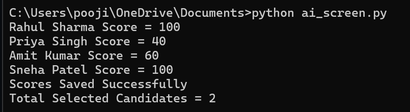
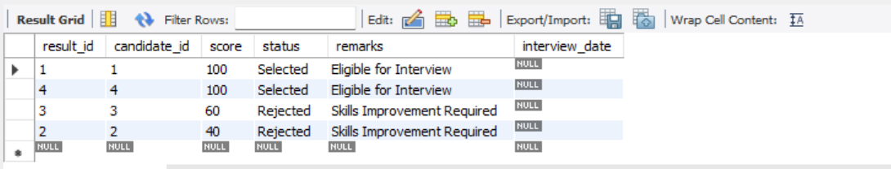

# AI-Resume-Screening-System
AI Resume Screening System using Python and MySQL
## Project Overview
This project automates resume screening using Python and MySQL. Candidates are evaluated based on their skills and experience, and a screening score is generated automatically.

## Technologies Used
- Python
- MySQL
- MySQL Connector
- SQL Queries

## Features
- Candidate data storage
- Automated resume screening
- Score calculation
- Candidate selection/rejection
- Interview eligibility tracking
- SQL reporting queries

## Database Tables
### candidates
Stores candidate information.

### screening_results
Stores screening scores, status, remarks, and interview dates.

## Screenshots

### Python Output

### Database Results

## Sample Output
Selected candidates:
- Rahul Sharma
- Sneha Patel

Rejected candidates:
- Priya Singh
- Amit Kumar

## Future Enhancements
- Resume PDF parsing
- Machine Learning scoring
- Web interface using Flask
- Email notifications

## Author
Dornadula Venkata Sudha Lakshmi Nikitha
